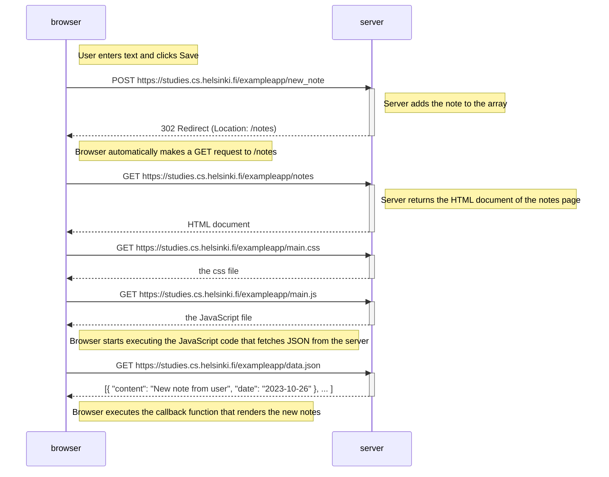

```mermaid
sequenceDiagram
    participant browser
    participant server

    Note right of browser: User enters text and clicks Save
    browser->>server: POST https://studies.cs.helsinki.fi/exampleapp/new_note
    activate server
    Note right of server: Server adds the note to the array
    server-->>browser: 302 Redirect (Location: /notes)
    deactivate server

    Note right of browser: Browser automatically makes a GET request to /notes
    browser->>server: GET https://studies.cs.helsinki.fi/exampleapp/notes
    activate server
    Note right of server: Server returns the HTML document of the notes page
    server-->>browser: HTML document
    deactivate server

    browser->>server: GET https://studies.cs.helsinki.fi/exampleapp/main.css
    activate server
    server-->>browser: the css file
    deactivate server

    browser->>server: GET https://studies.cs.helsinki.fi/exampleapp/main.js
    activate server
    server-->>browser: the JavaScript file
    deactivate server

    Note right of browser: Browser starts executing the JavaScript code that fetches JSON from the server
    browser->>server: GET https://studies.cs.helsinki.fi/exampleapp/data.json
    activate server
    server-->>browser: [{ "content": "New note from user", "date": "2023-10-26" }, ... ]
    deactivate server

    Note right of browser: Browser executes the callback function that renders the new notes
```