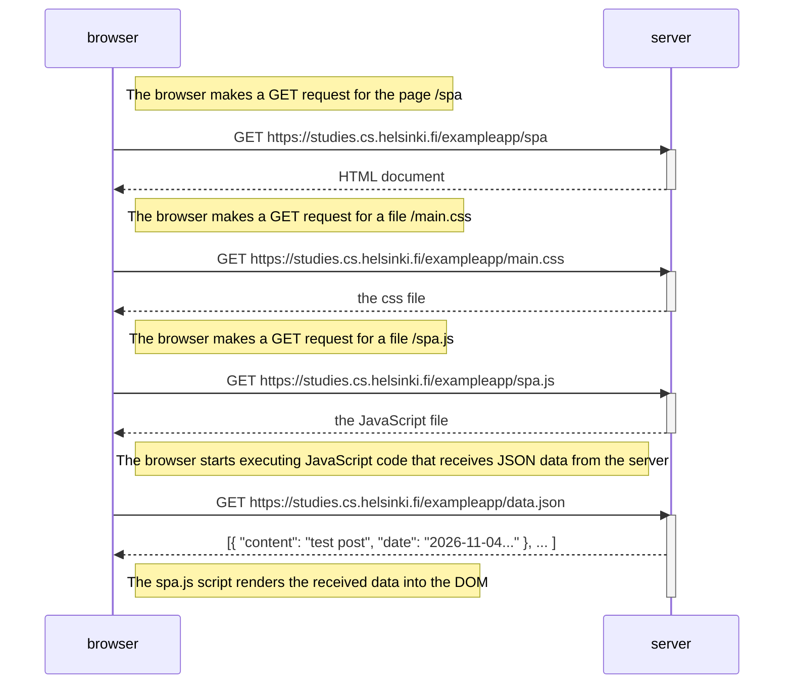

```mermaid
sequenceDiagram
    participant browser
    participant server

    Note right of browser: The browser makes a GET request for the page /spa
    browser->>server: GET https://studies.cs.helsinki.fi/exampleapp/spa
    activate server
    server-->>browser: HTML document
    deactivate server

    Note right of browser: The browser makes a GET request for a file /main.css
    browser->>server: GET https://studies.cs.helsinki.fi/exampleapp/main.css
    activate server
    server-->>browser: the css file
    deactivate server

    Note right of browser: The browser makes a GET request for a file /spa.js
    browser->>server: GET https://studies.cs.helsinki.fi/exampleapp/spa.js
    activate server
    server-->>browser: the JavaScript file
    deactivate server

    Note right of browser: The browser starts executing JavaScript code that receives JSON data from the server
    browser->>server: GET https://studies.cs.helsinki.fi/exampleapp/data.json
    activate server
    server-->>browser: [{ "content": "test post", "date": "2026-11-04..." }, ... ]
    Note right of browser: The spa.js script renders the received data into the DOM
    deactivate server
```