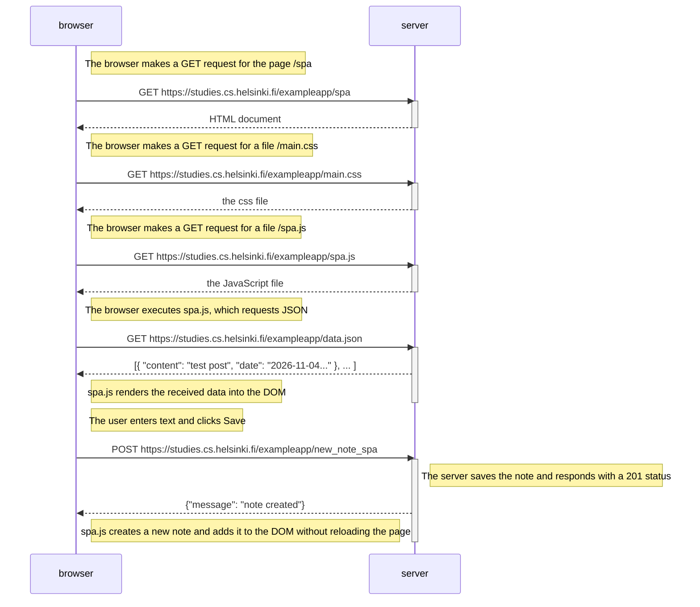

```mermaid
sequenceDiagram
    participant browser
    participant server

    Note right of browser: The browser makes a GET request for the page /spa
    browser->>server: GET https://studies.cs.helsinki.fi/exampleapp/spa
    activate server
    server-->>browser: HTML document
    deactivate server

    Note right of browser: The browser makes a GET request for a file /main.css
    browser->>server: GET https://studies.cs.helsinki.fi/exampleapp/main.css
    activate server
    server-->>browser: the css file
    deactivate server

    Note right of browser: The browser makes a GET request for a file /spa.js
    browser->>server: GET https://studies.cs.helsinki.fi/exampleapp/spa.js
    activate server
    server-->>browser: the JavaScript file
    deactivate server

    Note right of browser: The browser executes spa.js, which requests JSON
    browser->>server: GET https://studies.cs.helsinki.fi/exampleapp/data.json
    activate server
    server-->>browser: [{ "content": "test post", "date": "2026-11-04..." }, ... ]
    Note right of browser: spa.js renders the received data into the DOM
    deactivate server

    Note right of browser: The user enters text and clicks Save
    browser->>server: POST https://studies.cs.helsinki.fi/exampleapp/new_note_spa
    activate server
    Note right of server: The server saves the note and responds with a 201 status
    server-->>browser: {"message": "note created"}
    Note right of browser: spa.js creates a new note and adds it to the DOM without reloading the page
    deactivate server
```