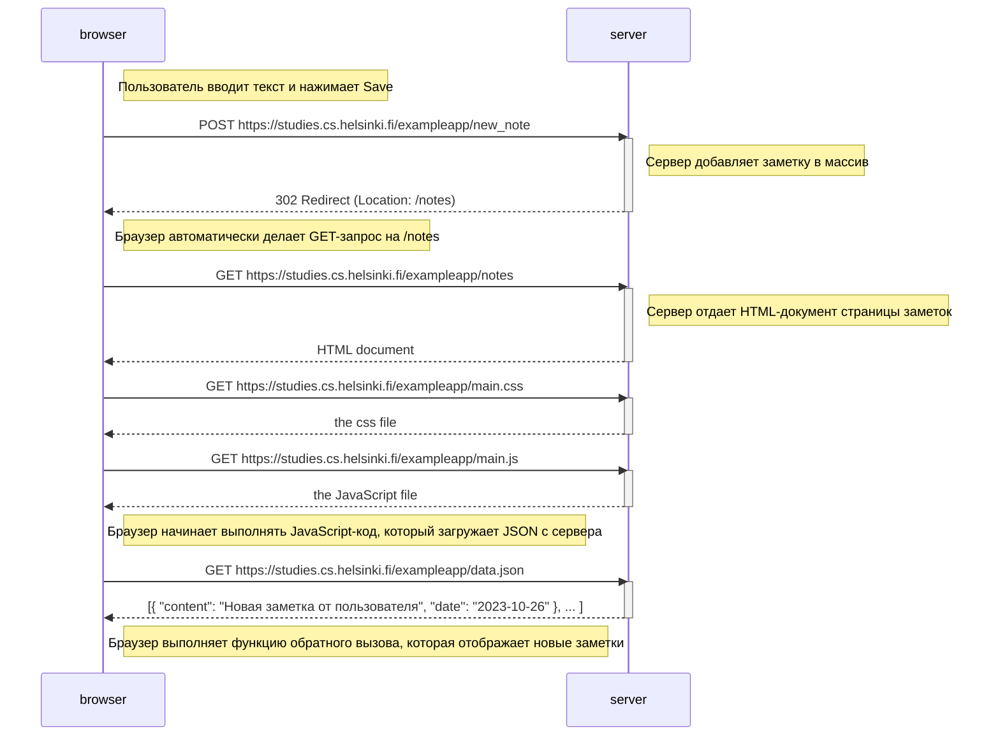

```mermaid
sequenceDiagram
    participant browser
    participant server

    Note right of browser: Пользователь вводит текст и нажимает Save
    browser->>server: POST https://studies.cs.helsinki.fi/exampleapp/new_note
    activate server
    Note right of server: Сервер добавляет заметку в массив
    server-->>browser: 302 Redirect (Location: /notes)
    deactivate server

    Note right of browser: Браузер автоматически делает GET-запрос на /notes
    browser->>server: GET https://studies.cs.helsinki.fi/exampleapp/notes
    activate server
    Note right of server: Сервер отдает HTML-документ страницы заметок
    server-->>browser: HTML document
    deactivate server

    browser->>server: GET https://studies.cs.helsinki.fi/exampleapp/main.css
    activate server
    server-->>browser: the css file
    deactivate server

    browser->>server: GET https://studies.cs.helsinki.fi/exampleapp/main.js
    activate server
    server-->>browser: the JavaScript file
    deactivate server

    Note right of browser: Браузер начинает выполнять JavaScript-код, который загружает JSON с сервера
    browser->>server: GET https://studies.cs.helsinki.fi/exampleapp/data.json
    activate server
    server-->>browser: [{ "content": "Новая заметка от пользователя", "date": "2023-10-26" }, ... ]
    deactivate server

    Note right of browser: Браузер выполняет функцию обратного вызова, которая отображает новые заметки
```